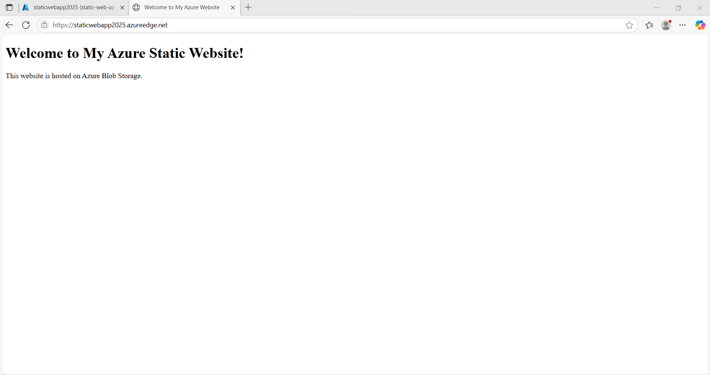
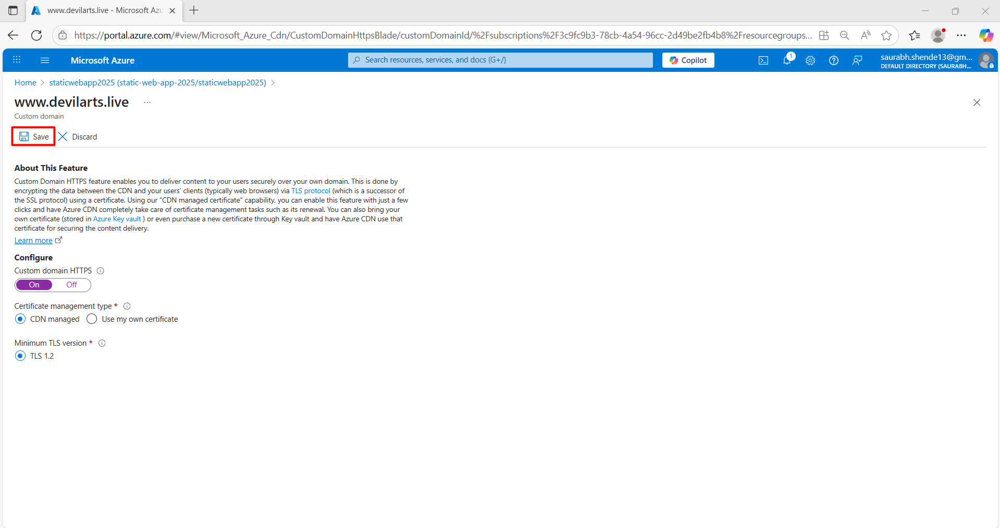

# Static Website Hosting on Azure using Azure Blob, CDN, and DNS Zones

This project demonstrates how to host a static website on **Azure Blob Storage** with a **Content Delivery Network (CDN)** and a **custom domain** configured via **Azure DNS Zones**.

The setup covers:

* Creating resources in Azure
* Deploying static website files to Blob Storage
* Configuring CDN for global delivery and caching
* Setting up DNS for a custom domain with HTTPS

---

## Architecture Overview

1. **Azure Storage Account** – Hosts the static web content in the special `$web` container.
2. **Azure CDN** – Delivers content globally with improved performance and caching.
3. **Azure DNS Zone** – Provides custom domain mapping for the CDN endpoint.
4. **Custom Domain with HTTPS** – Securely serves content via SSL/TLS.

---

## Steps

### 1. Create a Resource Group in Azure

A resource group logically groups all Azure resources for easier management and organization.

---

### 2. Create a Storage Account

This storage account will be used to host the static site.

---

### 3. Enable Static Website for the Storage Account

* Enable **Static Website Hosting** in the storage account.
* This automatically creates a `$web` container where your website files will be stored.
* Configure the **index document** (e.g., `index.html`) and optionally an **error document** (e.g., `404.html`).

---

### 4. Upload Content in `$web` Container

Upload your static files (HTML, CSS, JS, images) into the `$web` container.

---

### 5. Enable Anonymous Access

* Configure storage account access to allow **public anonymous read access** for blobs.
* This ensures website visitors can fetch your static files directly without authentication.

---

### 6. Create a CDN Profile and Endpoint

* Create an **Azure CDN Profile**.
* Add a **CDN Endpoint** pointing to your `$web` container in Blob Storage.
* This improves website performance and reduces latency by serving cached content closer to users.

#### Access using CDN domain

At this stage, your website is accessible via the **CDN endpoint domain** provided by Azure.

---

### 7. Create DNS Zone and Record Set

* Set up a **DNS Zone** in Azure to manage your domain.
* Ensure your **domain registrar is pointing to Azure nameservers**.

#### Create record set with CDN endpoint as CNAME

Add a **CNAME record** that maps your custom domain (e.g., `www.example.com`) to the Azure CDN endpoint.

---

### 8. Add Custom Domain to CDN

* Link your custom domain with the Azure CDN endpoint.

#### Add HTTPS to custom domain

* Enable **HTTPS** using Azure-managed certificates for secure browsing.

---

### 9. Verify Website Using Custom Domain

Finally, visit your website using your **custom domain**. Verify that:

* The static site loads properly.
* HTTPS is working.
* The content is served through the CDN.

---

## Key Notes

* Ensure your **domain’s nameservers** are updated to point to Azure DNS.
* CDN may take a few minutes to propagate changes globally.
* Always test both the **CDN endpoint** and the **custom domain**.

---

## Technologies Used

* **Azure Blob Storage** (Static Website Hosting)
* **Azure CDN** (Global Content Delivery)
* **Azure DNS Zones** (Domain Management)
* **Custom Domain + HTTPS**

---
